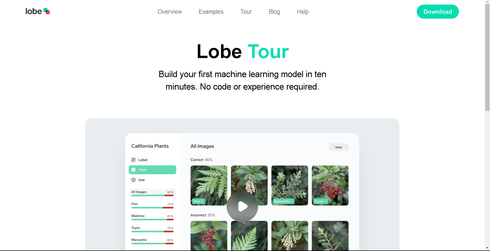

# Lobe Tour

Hello Everyone, I have started this project to master Web Development and improve my skills.

### Desktop View

### Live Site
https://www.lobe.ai/tour

### Links:

* Template: https://www.frontendpractice.com/projects/lobe
* Code: https://github.com/Utkarsh3128/FrontendPractice-Lobe.git

### Built with
* HTML
* CSS

### Useful Resources

- .[CSS Tricks](https://css-tricks.com/): Very useful whenever got stuck while styling
- .[w3schools](https://www.w3schools.com/): Very helpful for learning basics

### Frontend Practice - Lobe Tour solution
